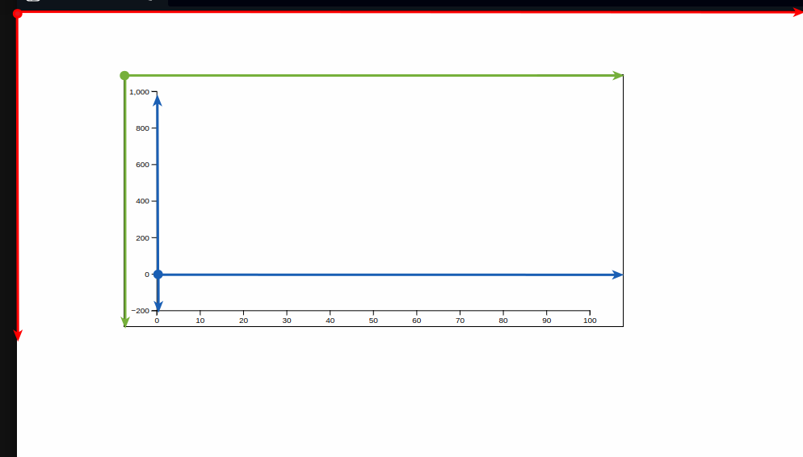

# Skadi Chart

Simple d3 graphing library used by Skadi (Static [Wodin](https://github.com/mrc-ide/wodin/blob/main/config-static/README.md))

# Basic commands

* `npm run build` - build project
* `npm run test:unit` - unit tests
* `npm run test:e2e` - end to end tests
* `npm run coverage` - coverage with v8 as provider
* `npm run dev` - start demo app in [./src/demo](./src/demo/)

# Coordinate systems

Some layers in this project deal with multiple coordinate systems and the code got quite confusing as we were not sure about which coordinate system certain variables were in. So we have tried to standardise some variables names to avoid confusion in some layers such as the [TooltipsLayer](./src/layers/TooltipsLayer.ts). We deal with 3 coordinate systems:

Each coordinate system has its origin highlighted with the circle, and x and y axes shown. Details for each color:

* Red: These are the client coordinates that keep track of where elements in the DOM are relative to the red origin in the top left hand corner of the webpage. These coordinates are measured in pixels. Variables in this coordinate system will be suffixed with `CC` (client coordinates).

* Green: The svg we generate has a view box equal to the width and height of the svg element, which allows us to have a 1-to-1 mapping of svg coordinates and client pixels (see [this](https://developer.mozilla.org/en-US/docs/Web/SVG/Tutorials/SVG_from_scratch/Positions) for more details). The green axes then represent the position of elements of the svg relative to its top left corner. These are also measured in pixels. Variables in this coordinate system will be suffixed with `SC` (svg coordinates).

* Blue: We draw axes on the svg itself that represent the data coordinates of the traces the user puts in. These are measured with units equal to the user data which is not the same as pixels. Variables in this coordinate system will be suffixed with `DC` (data coordinates).

Note that for the svg coordinates and client coordinates the y-value increases downwards (having the origin in the top-left), but for the data coordinates it increases upwards (origin bottom-left).
