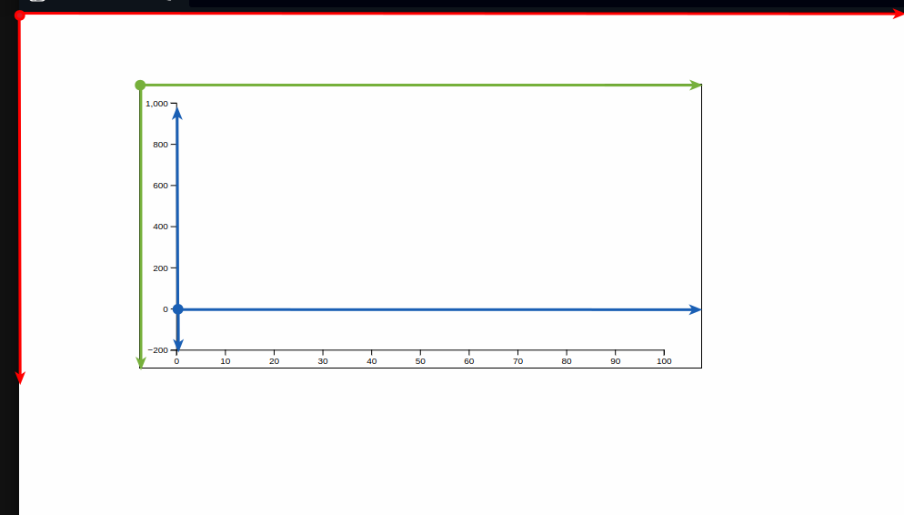

# Skadi Chart

Simple d3 graphing library used by Skadi ([Static Wodin](https://github.com/mrc-ide/wodin/blob/main/config-static/README.md))

# Basic commands

* `npm run build` - build project
* `npm run test:unit` - unit tests
* `npm run test:e2e` - end to end tests
* `npm run coverage` - coverage with v8 as provider
* `npm run dev` - start demo app in [./src/demo](./src/demo/)

# Trace performance comparison

With the demo running, open `http://localhost:5173/?traceBenchmark` (also linked from
the main demo). This isolates the benchmark from the other charts. The original
new-interface stress demo now uses `RDPEpsilon: 1`, matching the legacy stress demo;
use the isolated benchmark for an apples-to-apples comparison.

The full benchmark generates one deterministic dataset of 1,000 traces × 1,000
points and shares the same objects between both implementations. It uses identical
styles, explicit linear domains, margins and a 1,000 × 500 container, with only the
traces layer enabled. It first compares RDP epsilon 1, then disables simplification
on both. Each mode discards two warm-up pairs and records six measured pairs,
alternating which implementation runs first. The smaller dataset is a smoke test,
not a performance substitute.

The table reports medians; raw samples and browser details are available as JSON:

* Generation is timed once, outside all chart timings.
* Configuration includes registration, domain scanning, scales and detached SVG setup.
* Draw + mount includes coordinate conversion, simplification, path construction and
  SVG insertion. Legacy configuration is timed up to its public trace layer's `draw`
  call; the new interface is timed up to `end()`. No other layers are drawn.
* Frame wait is double-requestAnimationFrame latency after mounting, **not paint
  duration**. Keep the tab visible and the chart in view.
* Retained points count SVG M/L commands after drawing. All benchmark points are
  inside the fixed domains, so no clipping removes points. Path characters measure
  total `d` attribute length, not total SVG markup.

Run the existing Playwright harness for actual Chromium main-thread Paint event
durations and downloadable diagnostic artifacts:

```sh
TRACE_BENCHMARK=1 npm run test:e2e -- tests/e2e/trace-benchmark.spec.ts --project=chromium --workers=1
```

The opt-in test first collects unprofiled timings, then repeats with a browser
timeline. If the new interface's median synchronous time exceeds legacy by both
10% and 5 ms in either mode, that second run also captures a CPU profile and V8 GC
events. Inspect configuration-phase marks for scale iteration and GC in the
timeline, and load the `.cpuprofile` in DevTools. Report attachments contain baseline
samples/medians, per-sample Paint times, the timeline, and the conditional CPU profile.
Paint times exclude compositor/GPU raster work; zero Paint events mean no work was
observed for that sample, not proof of zero rendering cost. Profiled timings should
not be compared directly to the baseline. Repeat runs before drawing conclusions;
there are no CI timing thresholds, only workload/metric correctness assertions.

# Coordinate systems

Some layers in this project deal with multiple coordinate systems and the code got quite confusing as we were not sure about which coordinate system certain variables were in. So we have tried to standardise some variables names to avoid confusion in some layers such as the [TooltipsLayer](./src/layers/TooltipsLayer.ts). We deal with 3 coordinate systems:



Each coordinate system has its origin highlighted with the circle, and x and y axes shown. Details for each color:

* Red: These are the client coordinates that keep track of where elements in the DOM are relative to the red origin in the top left hand corner of the webpage. These coordinates are measured in pixels. Variables in this coordinate system will be suffixed with `CC` (client coordinates).

* Green: The svg we generate has a view box equal to the width and height of the svg element, which allows us to have a 1-to-1 mapping of svg coordinates and client pixels (see [this](https://developer.mozilla.org/en-US/docs/Web/SVG/Tutorials/SVG_from_scratch/Positions) for more details). The green axes then represent the position of elements of the svg relative to its top left corner. These are also measured in pixels. Variables in this coordinate system will be suffixed with `SC` (svg coordinates).

* Blue: We draw axes on the svg itself that represent the data coordinates of the traces the user puts in. These are measured with units equal to the user data which is not the same as pixels. Variables in this coordinate system will be suffixed with `DC` (data coordinates).

Note that for the svg coordinates and client coordinates the y-value increases downwards (having the origin in the top-left), but for the data coordinates it increases upwards (origin bottom-left).
